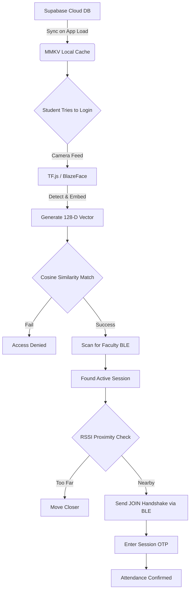

# 🎓 Academic Monitor: Student Authentication & BLE Attendance


The **Academic Monitor (Student App)** is a robust, offline-first React Native mobile application engineered specifically to solve the pervasive issues of **proxy attendance** and **spotty internet connectivity** in academic institutions.

By combining edge-based Artificial Intelligence (TensorFlow Lite) for facial verification with localized peer-to-peer Bluetooth Low Energy (BLE) networks for session joining, this app allows a student to securely authenticate their identity and mark attendance without requiring *any* active internet connection during class time.

---

## ✨ Comprehensive Feature Set

### 1. 🛡️ Offline-First Facial Recognition (Edge AI)
* **On-Device Processing:** Live camera feeds are processed entirely on the user's device via `react-native-vision-camera` and TensorFlow.js.
* **TFLite Integration:** Utilizes a lightweight MobileFaceNet model and BlazeFace to detect faces, crop, align, and extract 128-D embedding vectors in real-time.
* **Cosine Similarity Matching:** The live embedding is compared against the secure local cache of the student's baseline embedding.
* **Spoofing Prevention:** Built-in checks ensure that a physical photograph or a screen cannot be used to bypass authentication, requiring a live feed.

### 2. 📡 Peer-to-Peer BLE Session Joining
* **Local Networking:** Once authenticated locally, the student's device scans for the secure BLE broadcast emitted by the Faculty app.
* **Zero Internet Required:** The handshake is initiated entirely offline over Bluetooth Low Energy, sending an encrypted JOIN request containing the student's Roll Number.
* **Proximity Gating:** The app leverages RSSI (Received Signal Strength Indicator) to guarantee the student is physically *inside* the classroom (e.g., > -70 dBm) before permitting attendance.

### 3. 🔐 Secure OTP Confirmation Protocol
* **Physical Presence Verification:** After joining the BLE session, the Faculty may require a session-specific 4-digit PIN. The student enters this OTP into their device to finalize the attendance.
* **Anti-Proxy Architecture:** Remote check-ins are physically impossible due to the combination of localized BLE transmission and dynamic OTP verification.

### 4. ⚡ Blazing Fast Local Storage (MMKV)
* The application employs `react-native-mmkv` to cache Supabase database embeddings and student profiles. This provides synchronous, high-speed read operations which are crucial for rendering UI states instantly and performing vector matching offline.

---

## 🏗️ Architecture & Data Flow



---

## 📂 Project Structure

```text
e:\Student_BLE\
├── android/                  # Native Android configuration
├── ios/                      # Native iOS configuration
├── assets/models/            # Contains mobilefacenet.tflite model
├── register_student.py       # Python utility for registering a student's face baseline
├── src/
│   ├── auth/                 # StudentAuthProvider for global auth state
│   ├── ble/                  # BLE Module, Constants, and Handshake Logic
│   ├── facerecg/             # TF.js Pipelines, Face Detectors, Embedding Extractor
│   ├── hooks/                # Custom React hooks (e.g., useFaceRecognition)
│   ├── screens/              # Core UI Screens
│   │   ├── FaceScanScreen    # The facial auth & scanning interface
│   │   ├── AttendanceScreen  # BLE scanning and OTP verification
│   │   └── RegisterScreen    # Fallback registration interface
│   └── services/             # Core business logic
│       ├── faceService.ts    # Model initialization and verification logic
│       ├── studentService.ts # Supabase synchronization
│       └── storageService.ts # MMKV secure storage logic
```

---

## 🚀 Getting Started

### Prerequisites
* **Node.js:** v18.x or newer
* **React Native CLI:** Environment set up for Android and iOS development
* **Python:** 3.8+ (for running the registration script)
* **Supabase:** A configured Supabase project with a `students` table (requires `face_embedding` vector columns).

### Installation & Execution

1. **Clone the Repository**
   ```bash
   git clone https://github.com/nitishvofficial/Student.git
   cd Student_BLE
   ```

2. **Install JavaScript Dependencies**
   ```bash
   npm install
   ```

3. **Configure Environment Variables**
   Ensure that the Supabase keys inside your `.env` file are correctly pointing to your cloud instance.

4. **Register a Student**
   Before testing the app, enroll a student's face via the python script:
   ```bash
   pip install opencv-python numpy tensorflow urllib3
   python register_student.py path/to/photo.jpg <UID> <Name> <RollNo> <Course> <Branch> <Semester> <Section>
   ```

5. **Start the Metro Bundler**
   ```bash
   npm start
   ```

6. **Run the Application**
   ```bash
   # In a new terminal window
   npm run android
   ```
   > *Note: For Face Recognition and BLE to work correctly, testing must be done on a physical device, not an emulator, as emulators lack reliable Bluetooth and camera hardware abstraction.*

---

## 🔒 Security & Privacy Notice
All biometric data processed by the Academic Monitor application remains on the physical device. During the facial recognition phase, the pipeline processes the camera feed in RAM, generates a mathematical embedding, compares it, and then flushes the image. **No raw photos, video feeds, or personal biometrics are uploaded or transmitted to the cloud during verification.**

---

## 🤝 Contributing
1. Fork the repository
2. Create your feature branch (`git checkout -b feature/AmazingFeature`)
3. Commit your changes (`git commit -m 'Add some AmazingFeature'`)
4. Push to the branch (`git push origin feature/AmazingFeature`)
5. Open a Pull Request

---

*Engineered for secure, offline, and reliable classroom attendance.*
